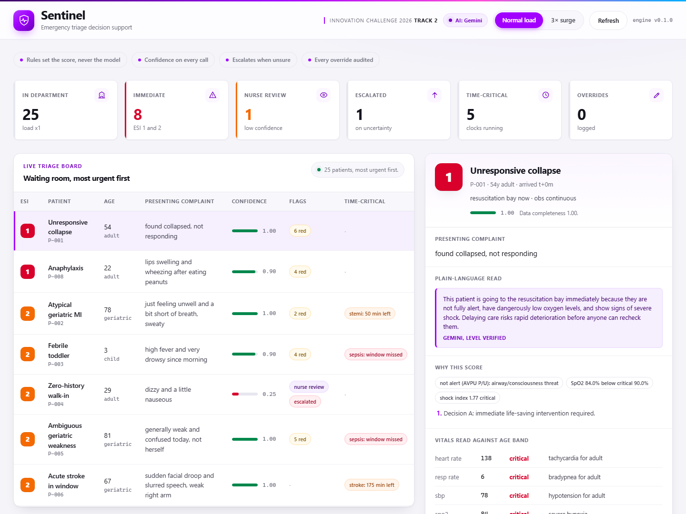

# Sentinel: PatientTriage.ai (Team Sentinel)

Accenture Innovation Challenge 2026, Round 2 prototype.

Sentinel is a decision-support triage assistant built around three agents:

1. **Interpreter**: structures sparse intake, computes indices (shock index,
   time since onset), flags vitals against **age-banded** danger zones, and
   scores data completeness into a confidence band.
2. **Adjudicator**: assigns an ESI-style acuity (1 to 5), runs time-critical
   clocks (stroke, STEMI, sepsis), sets a monitoring tier, and explains itself.
3. **Watcher**: monitors the waiting queue, spends a fixed attention budget on
   the sickest and most overdue patients, re-records their vitals, and only ever
   escalates ("priority ratchet"). A timer backstop alerts on any patient who
   passes their safe wait, so a saturated queue can never hide a patient.

Design rule that runs through everything: **under-triage is worse than
over-triage**, so danger-zone vitals only push acuity up, and genuine
uncertainty escalates and routes to a nurse rather than settling on a
comfortable middle score.



The live board with the most urgent patient opened automatically: vitals read against the patient's age band, the drivers behind the score, a plain-language read (here written by Gemini and verified against the engine's level), and the override control.

## Round 2 deliverables

- **Business proposal**: [`docs/business-proposal.md`](docs/business-proposal.md). Problem framing, solution design, target users, business case and impact, phased roadmap, risks and mitigations, plus data protection and compliance.
- **Working prototype**: this repository. Run it with the commands below.
- **Pitch**: [`docs/pitch.md`](docs/pitch.md) is the slide-by-slide script and speaker notes, built to be delivered live off the running board. The deck itself is [`docs/Sentinel_Pitch.pptx`](docs/Sentinel_Pitch.pptx), a custom Sentinel-branded PowerPoint (no Accenture logo) regenerated with `python tools/build_pitch_deck.py`.
- **Demo video**: _add the link here before submitting._
- **Build plan**: [`docs/round2-plan.md`](docs/round2-plan.md). How the prototype maps to the graded checklist, and the calibration decisions worth defending.

## How it meets the Track 2 brief

Every minimum prototype expectation for PatientTriage.ai, and where to see it.

| Requirement | Where to see it |
| --- | --- |
| Triage scoring on 15 to 20 simulated records | 25-patient cohort. The board at `/`, or `python run_demo.py`. |
| One ambiguous, one pediatric or geriatric, one zero-history case | Ambiguous elderly weakness (P-005), febrile toddler (P-003) and atypical geriatric MI (P-002), zero-history walk-in (P-004). |
| Behaviour under a 3x surge | The surge toggle on the board, or `python run_watch.py`. |
| No score without a confidence indicator | A confidence band on every board row and in the drill-down; low confidence routes to a nurse. |
| Capture a clinician override and show what it logs | The override form in the inspector, the audit-trail tab, and `tests/test_api.py`. |
| Waiting-room deterioration monitoring | The Watcher tab and `run_watch.py`. P-011 arrives stable and is caught deteriorating while waiting. |
| Age-specific vital thresholds | `engine/thresholds.py`, shown as "vitals read against age band" in the drill-down. |
| Named jurisdiction and an audit trail | HIPAA (US) assumed; append-only, reason-required trail in `app/audit.py`. |

## Layout

```
sentinel/
  backend/
    app/
      models.py            # shared pydantic contracts
      api.py                 # FastAPI service (board, override, audit, intake, telemetry)
      state.py               # in-memory department: cohort, results, overrides
      audit.py               # append-only override audit trail
      engine/
        thresholds.py        # age-banded vital ranges + shock index cutoffs
        interpreter.py       # Agent 1
        adjudicator.py       # Agent 2 (ESI + time-critical clocks + safety net)
        deterioration.py     # sim-only vitals drift model for the waiting room
        watcher.py           # Agent 3 + waiting-room simulation + surge harness
        pipeline.py          # compose agents
      llm/
        config.py            # .env + mode/model/key + price table (all optional)
        gemini.py            # guarded google-genai client (lazy import, cache)
        stub.py              # rule-based intake parser + template explainer
        service.py           # parse + score + explain, ESI-flip guard, telemetry
      data/
        generator.py         # deterministic synthetic cohort (+ 3x surge mode)
      static/                # triage board UI (no build step)
    tests/
      test_engine.py         # safety tests (assert no under-triage)
      test_watcher.py        # Watcher tests (never de-escalate, catch decline)
      test_api.py            # override + audit trail tests
      test_llm.py            # parser, deterministic scoring, ESI-flip guard, telemetry
    run_demo.py              # print the triage board + key-case detail
    run_watch.py             # normal vs 3x surge waiting-room simulation
    run_server.py            # serve the API and the board
    requirements.txt
    .env.example             # copy to .env to enable Gemini (optional)
```

## Run it (Python 3.11+, from `sentinel/backend`)

```powershell
python -m pip install -r requirements.txt
python run_server.py      # then open http://127.0.0.1:8000 (API docs at /docs)
python run_demo.py        # triage board in the terminal
python run_watch.py       # waiting-room sim: normal load vs 3x surge
python -m pytest -q       # safety tests
```

On macOS or Linux use `python3` in place of `python`. The commands are otherwise identical.

The UI is plain HTML, CSS and JavaScript served by FastAPI, so there is no build
step and the whole prototype runs from one process. That is a deliberate choice:
the plan flags demo fragility as a risk, and one command is harder to break on
stage than two. The API returns plain JSON, so a React front end could be
dropped in later without touching the engine.

## Demo in two minutes

1. Start the server and open http://127.0.0.1:8000. The board loads with the most urgent patient already open on the right.
2. Point at the confidence bar and "vitals read against age band", then open the zero-history walk-in (P-004): confidence drops and it routes to a nurse instead of guessing.
3. Flip to 3x surge, open the Watcher tab, and show P-011 caught deteriorating in the waiting room while the longest unsafe wait climbs.
4. On any patient, record an override with a reason, then open the audit-trail tab to show exactly what was logged.

## The LLM layer (optional)

The model does exactly two jobs, both at the edges: it reads a free-text note
into structured intake fields, and it rewrites a decision into plain language.
It never sets an acuity. That number always comes from the deterministic engine,
which is the answer to "isn't this just an LLM guessing at medicine".

It is off by default. With no key, the app runs in rule-based mode: a regex
parser handles intake and a template writes the explanation, so every feature
still works offline. The Gemini packages are already in `requirements.txt`, so
to switch it on you only need a key. Copy `.env.example` to `.env` and paste in
a free key from [Google AI Studio](https://aistudio.google.com):

```powershell
copy .env.example .env   # macOS or Linux: cp .env.example .env
```

`.env` is gitignored, so your key is never committed. Guards that keep it safe:
calls run at temperature 0 and are cached (same demo, same words, almost no
quota), a hard timeout falls back to the template, and a generated explanation
that names a different ESI level is rejected. Every call is timed and costed in
the telemetry tab.

## Status

- [x] Age-banded thresholds (infant / child / adolescent / adult / geriatric)
- [x] Synthetic cohort with required edge cases (ambiguous, pediatric, geriatric, zero-history)
- [x] Interpreter + Adjudicator with confidence and time-critical clocks
- [x] Safety tests: 0 under-triage on the labelled cohort
- [x] Watcher: waiting-room monitoring, deterioration ratchet, timer backstop, 3x surge
- [x] FastAPI service + live triage board with patient drill-down
- [x] Override capture + append-only audit log
- [x] LLM free-text parsing and plain-language explanations (optional, rule-based fallback)
- [x] Runtime telemetry (latency, tokens, cost)
- [x] Custom Sentinel-branded UI (white and purple, no third-party logos), opens the most urgent patient by default
- [x] Business proposal and pitch deck (see Round 2 deliverables)

Assumptions are illustrative; assumed jurisdiction is HIPAA (US). Thresholds
are adapted from standard references and are configurable, not clinical advice.
